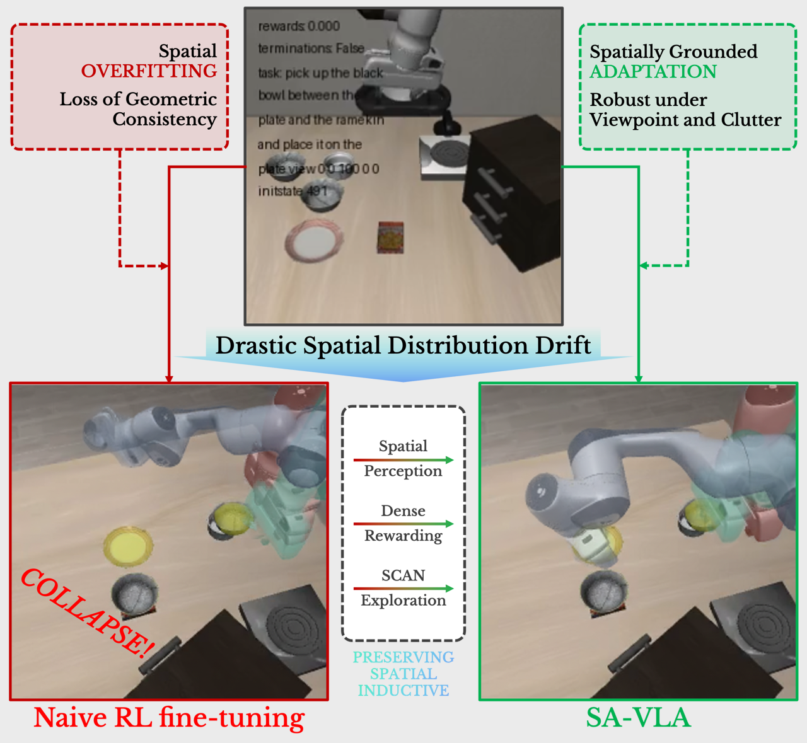
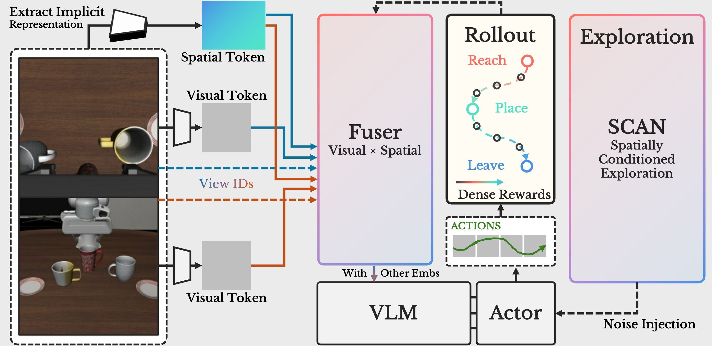

# SA-VLA: Spatially-Aware Reinforcement Learning for Flow-Matching Vision-Language-Action Models

<div align="center">

[](https://arxiv.org/abs/2602.00743)
[](https://xupan.top/Projects/savla)
[](https://doi.org/10.48550/arXiv.2602.00743)

<span class="author-block">
  <a href="https://xupan.top/" target="_blank">Xu Pan</a><sup>1,2</sup>,</span>
<span class="author-block">
  <a href="https://vanzll.github.io/" target="_blank">Zhenglin Wan</a><sup>3</sup>,</span>
<span class="author-block">
  <a href="https://xingruiyu.github.io/" target="_blank">Xingrui Yu</a><sup>2,*</sup>,</span>
<span class="author-block">
  <a href="https://jszy.whu.edu.cn/zhengxianwei/zh_CN/index.htm" target="_blank">Xianwei Zheng</a><sup>1</sup>,</span>
<span class="author-block">
  <a href="https://openreview.net/profile?id=~Youkai_Ke2" target="_blank">Youkai Ke</a><sup>1</sup>,</span>
<span class="author-block">
  <a href="https://aaronsun2000.github.io/" target="_blank">Ming Sun</a><sup>4</sup>,</span>
<span class="author-block">
  <a href="https://people.ucas.ac.cn/~wr" target="_blank">Rui Wang</a><sup>4</sup>,</span>
<span class="author-block">
  <a href="https://ziweiwangthu.github.io/" target="_blank">Ziwei Wang</a><sup>5</sup>,</span>
<span class="author-block">
  <a href="https://www.a-star.edu.sg/cfar/about-cfar/management/prof-ivor-tsang" target="_blank">Ivor Tsang</a><sup>2</sup></span>

<p style="font-size: 0.7em; margin: 10px 0 0 0;">
<sup>1</sup>State Key Laboratory of Information Engineering in Surveying, Mapping and Remote Sensing (LIESMARS), Wuhan University<br/>
<sup>2</sup>Centre for Frontier AI Research (CFAR), Institute of High Performance Computing (IHPC), Agency for Science, Technology and Research (A*STAR)<br/>
<sup>3</sup>Department of Computer Science, National University of Singapore<br/>
<sup>4</sup>Institute of Information Engineering, Chinese Academy of Sciences<br/>
<sup>5</sup>School of Electrical and Electronic Engineering, Nanyang Technological University<br/>
<sup>*</sup>Corresponding Author
</p>

</div>

This repository contains the source code for the paper **SA-VLA: Spatially-Aware Reinforcement Learning for Flow-Matching Vision-Language-Action Models**.

SA-VLA is developed on top of the [RLinf](https://github.com/RLinf/RLinf) reinforcement learning framework.

---

<div align="center">
  
</div>

SA-VLA introduces a spatially-aware reinforcement learning approach for training flow-matching vision-language-action models. By incorporating spatial reasoning and RL fine-tuning, our method significantly improves generalization and task performance in embodied AI scenarios.

## Method Overview

<div align="center">
  
</div>

<strong>Overview of SA-VLA.</strong>
Visual and spatial tokens are fused into geometry-aware embeddings, which are optimized via step-level dense rewards and spatially-conditioned exploration (SCAN) for robust RL adaptation.

---

## Prerequisites

### RLinf Framework Setup

Please follow the instructions in [README.RLinf.md](README.RLinf.md) to configure the RLinf framework.

**Important:** When pulling the RLinf source code inside the container, replace it with this repository instead:

```bash
git clone https://github.com/TwSphinx54/SA-VLA.git
cd SA-VLA
```

### Additional Container Setup

After the container is set up, run the additional setup script:

```bash
bash scripts/setup_container.sh
```

---

## Deployment

### 1. Model Code Deployment

Copy the custom model code to the OpenPi site-packages:

```bash
cp -r srcs/openpi/models_pytorch /opt/venv/openpi/lib/python3.11/site-packages/openpi/models_pytorch
```

### 2. LIBERO-PLUS Dataset Deployment

Deploy the LIBERO-PLUS dataset from [LIBERO-plus](https://github.com/sylvestf/LIBERO-plus) to `/opt/venv/openpi/` and rename the directory to `libero_plus`:

```bash
mv /opt/venv/openpi/LIBERO-plus /opt/venv/openpi/libero_plus
```

### 3. Benchmark Files Deployment

Copy the provided benchmark files to the LIBERO library:

```bash
cp -r srcs/libero_plus/benchmark /opt/venv/openpi/libero/libero/libero/benchmark
```

### 4. Weights Placement

Place all model weights in the `weights/` directory with the following structure:

```
weights
|-- Pi05-LIBERO
|   |-- Sylvest
|   |   `-- ...
|   |-- config.json
|   |-- model.safetensors
|   `-- physical-intelligence
|       `-- ...
|-- Pi05-VGGT-LIBERO-FUSER-SFT_BF16
|   |-- Sylvest
|   |   `-- ...
|   |-- metadata.pt
|   |-- model.safetensors
|   |-- optimizer.pt
|   `-- physical-intelligence
|       `-- ...
`-- RLinf-Pi05-SFT
    |-- README.md
    |-- configuration.json
    |-- model.safetensors
    `-- physical-intelligence
        `-- ...
```

---

## Training

### Step 1: FUSER Adaptation Training on LIBERO

First, we perform FUSER adaptation training on LIBERO to obtain the base model `Pi05-VGGT-LIBERO-FUSER-SFT_BF16` for subsequent RL training. This step can be completed using the official [OpenPi](https://github.com/Physical-Intelligence/openpi) framework.

**Requirements:**
- Place `srcs/openpi/models_pytorch` in the OpenPi site-packages (as done in Deployment Step 1).
- Download the official VGGT weights from [https://github.com/facebookresearch/vggt](https://github.com/facebookresearch/vggt).

We provide the necessary configuration and scripts at `srcs/openpi`:
- `config.py`
- `train_fuser.py`
- `train_fuser.sh`

To start training:

```bash
bash train_fuser.sh
```

### Step 2: RL Training

After obtaining the base model from Step 1, proceed with RL training.

#### Environment Switching

Use `scripts/switch_libero.sh` to switch between LIBERO and LIBERO-PLUS environments:

```bash
# Switch to libero_plus
bash scripts/switch_libero.sh libero_plus

# Switch back to libero
bash scripts/switch_libero.sh libero
```

**Important:** After switching environments, update the `is_libero_plus` field in `examples/embodiment/config/env/libero_spatial.yaml` accordingly.

#### Dataset Configuration

By default, we use a sparse spatial perturbation subset of LIBERO-PLUS for few-shot experiments. 

To switch between subsets, full sets, or the complete LIBERO-PLUS dataset, modify the `libero_task_map` and `task_num` in:
```
/opt/venv/openpi/libero/libero/libero/benchmark/__init__.py
```

We provide scripts for subset selection and sparsification:
- `scripts/prepare_lp_sparse.py`
- `scripts/prepare_lp_spatial.py`

#### Start RL Training

Once the environment and dataset are configured:

```bash
bash examples/embodiment/run_embodiment.sh libero_spatial_ppo_openpi_pi05
```

---

## Evaluation

The dataset setup and environment switching for evaluation are the same as for training.

**Steps:**
1. Specify the model weights to use in `examples/embodiment/config/libero_spatial_ppo_openpi_pi05_eval.yaml`.
2. Run evaluation:

```bash
# Single evaluation
bash examples/embodiment/eval_embodiment.sh libero_spatial_ppo_openpi_pi05_eval

# Batch evaluation across multiple checkpoints
python scripts/evaluate_across_steps.py
```

---

## License

This project is licensed under the Apache-2.0 License - see the [LICENSE](LICENSE) file for details.

---

## Citation

If you find this work useful, please cite it using the following BibTeX entry:

```bibtex
@misc{pan2026savlaspatiallyawareflowmatchingvisionlanguageaction,
      title={SA-VLA: Spatially-Aware Flow-Matching for Vision-Language-Action Reinforcement Learning}, 
      author={Xu Pan and Zhenglin Wan and Xingrui Yu and Xianwei Zheng and Youkai Ke and Ming Sun and Rui Wang and Ziwei Wang and Ivor Tsang},
      year={2026},
      eprint={2602.00743},
      archivePrefix={arXiv},
      primaryClass={cs.RO},
      url={https://arxiv.org/abs/2602.00743}, 
}
```

---

## Acknowledgments

This project is built upon the [RLinf](https://github.com/RLinf/RLinf) framework. We thank the authors for their excellent work.

We also acknowledge the following projects that were instrumental to our research:
- [LIBERO](https://github.com/Lifelong-Robot-Learning/LIBERO) and [LIBERO-PLUS](https://github.com/sylvestf/LIBERO-plus) for providing comprehensive robotic manipulation benchmarks.
- [OpenPi](https://github.com/Physical-Intelligence/openpi) for the foundational VLA training framework.
- [VGGT](https://github.com/facebookresearch/vggt) for the pre-trained visual-geometric features.
